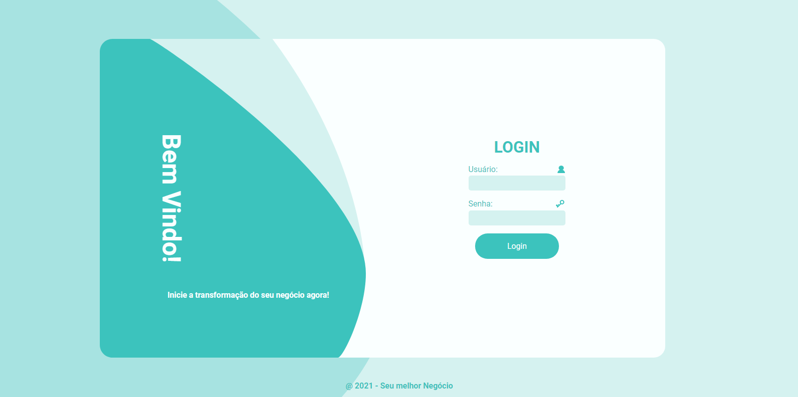
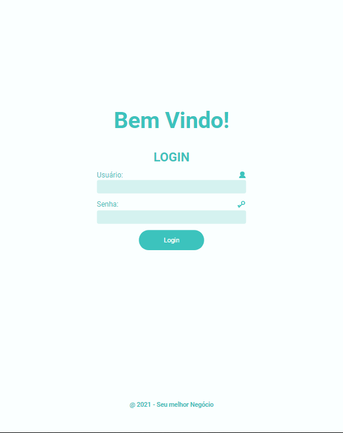
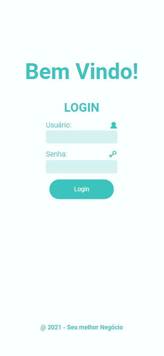

# Seu melhor Negócio

* Esse é um projeto de layout de um site estático.
* Procurei por soluções de responsividade com meu conhecimento atual.
* O projeto foi criado no Figma e montado com HTML e CSS.

Arquivo base do Figma: https://www.figma.com/file/6S9637x9abCwe1Men4rzNQ/Seu-melhor-Neg%C3%B3cio?node-id=0%3A1

# O resultado foi esse:

